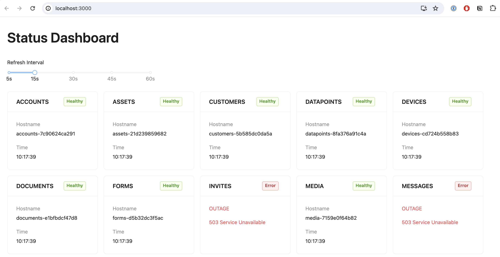

## FactoryFour Frontend Dev Take-Home Challenge

**Clean & Efficient UI:** Built with Ant Design for a polished user experience.

**Streamlined API Calls:** Leveraged react-query for efficient API health checks.

**Modular Design:** Code is structured into well-defined, reusable components for maintainability.

## Project Approach

A provided PDF outlined a clear preference for a simple user interface. To achieve this, I opted for [Ant Design](https://ant.design/) as it facilitates a clean and efficient design. Additionally, I leveraged react-query to streamline API health checks and minimize boilerplate code for data fetching.

To promote maintainability, the application is structured into reusable and well-defined components. 

**Future Considerations:**

While this project serves as a quick demonstration of my skills, a more comprehensive solution would incorporate the following in a real-world scenario:

* **Component Testing:** Implementing Storybook would enable isolated component testing, ensuring their reusability and consistency across the application.
* **Unit Testing:** Unit tests with Jest would be established to verify the functionality of custom data fetching functions and individual components.
* **End-to-End (E2E) Testing:** Introducing E2E tests using a tool like Cypress would validate user flows and happy paths within the application.

These additional tests provide a safety net for future development, ensuring code stability and preventing regressions.

## Available Scripts

In the project directory, you can run:

### `npm start`

Runs the app in the development mode. Open http://localhost:3000 to view it in your browser.

The page will reload when you make changes. You may also see any lint errors in the console.

### `npm test`

Launches the test runner in the interactive watch mode. See the section about running tests: [https://facebook.github.io/create-react-app/docs/running-tests](https://facebook.github.io/create-react-app/docs/running-tests) for more information.

### `npm run build`

Builds the app for production to the `build` folder. It correctly bundles React in production mode and optimizes the build for the best performance.

The build is minified and the filenames include the hashes. Your app is ready to be deployed!

See the section about deployment: [https://facebook.github.io/create-react-app/docs/deployment](https://facebook.github.io/create-react-app/docs/deployment) for more information.

### `npm run eject`

**Note: this is a one-way operation. Once you `eject`, you can't go back!**

If you aren't satisfied with the build tool and configuration choices, you can `eject` at any time. This command will remove the single build dependency from your project.

Instead, it will copy all the configuration files and the transitive dependencies (webpack, Babel, ESLint, etc) right into your project so you have full control over them. All of the commands except `eject` will still work, but they will point to the copied scripts so you can tweak them. At this point you're on your own.

You don't have to ever use `eject`. The curated feature set is suitable for small and middle deployments, and you shouldn't feel obligated to use this feature. However we understand that this tool wouldn't be useful if you couldn't customize it when you are ready for it.

## Discussion

I'm eager to walk you through my solution and discuss the challenges I encountered during development. This project provides a glimpse into my development approach and problem-solving skills.

Hopefully, the reviewers will find my approach effective and efficient.
